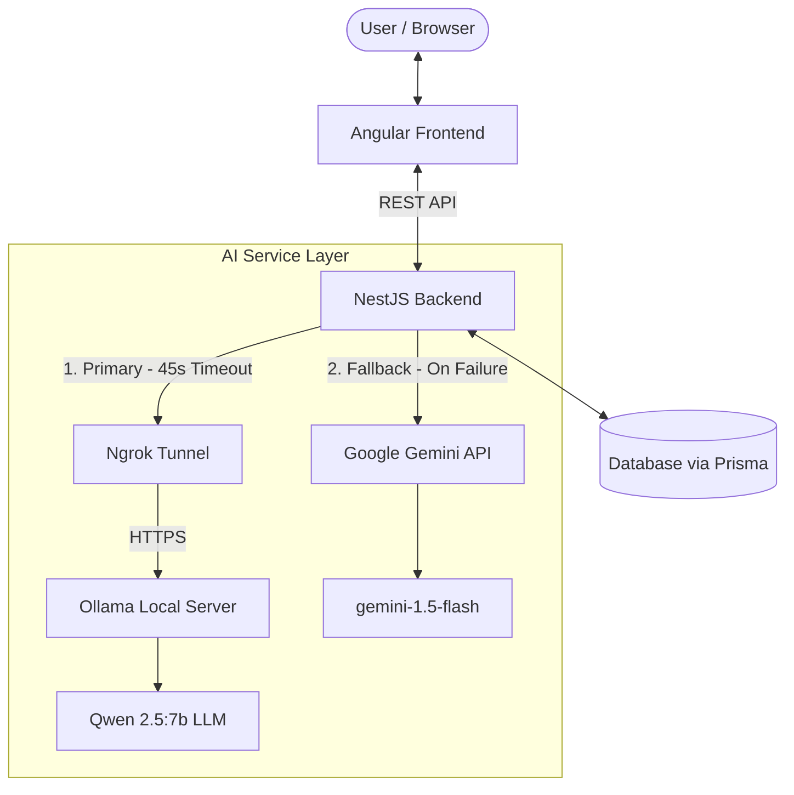

# FOOD AI BUSINESS ANALYTICS SYSTEM

An intelligent web application that analyzes food-industry business ideas, automatically generating a **Business Model Canvas (BMC)** and action strategies tailored for the Thai market.

---

## 🏗️ System Architecture

This project is built using a **Dual-Model LLM Failover Architecture** to optimize costs and guarantee 99.9% system availability. 



---

## 👥 Team Responsibilities & Contributions

The project was built collaboratively, dividing responsibilities into **Frontend/Core Backend** and **AI/System Integration**:

### 🧠 My Contributions: AI & Integration Developer
I was solely responsible for the AI pipeline, model orchestration, prompt engineering, and failover integration.
* **Local LLM Deployment**:
  * Deployed and configured the **Qwen 2.5 (7B)** model locally using **Ollama**.
  * Optimized parameters (`temperature: 0.3`, `num_ctx: 4096`) to generate high-quality strategic business advice.
* **Secure Microservice Tunneling**:
  * Integrated **Ngrok** to create a secure HTTPS tunnel, exposing the local Ollama API to the cloud-based/remote NestJS backend.
  * Resolved browser security headers (`ngrok-skip-browser-warning`) for seamless server-to-server calls.
* **Dual-Model Failover Logic (High Availability)**:
  * Designed and implemented the AI service logic in NestJS to query the local Qwen model first.
  * Configured a fallback route: if the local server times out (45s limit) or goes offline, it automatically redirects the query to the **Google Gemini API (gemini-1.5-flash)** as a backup.
* **Prompt Engineering & JSON Output Enforcement**:
  * Created advanced system prompts in `gemeni.prompt.ts` specialized for the Thai culinary market (incorporating food safety laws, Thai consumer behavior, and financial feasibility).
  * Enforced strict JSON responses from the models to prevent Markdown formatting issues, enabling reliable parsing directly into the frontend.

---

### 💻 Teammates' Contributions: Frontend & Core Backend Developer
My teammate developed the client application and general API infrastructure.
* **Frontend (Angular)**:
  * Designed the responsive user interface using modern components.
  * Implemented state management, user authentication forms, and dynamic data binding.
  * Developed the dynamic rendering interface for the **Business Model Canvas (BMC)** and action strategies.
* **Core Backend (NestJS)**:
  * Set up the core NestJS framework, routing, and controller structures.
  * Created authentication systems (JWT) and user management services.
  * Integrated **Prisma ORM** for database modeling, migrations, and operations.
  * Generated API endpoints and set up Swagger documentation.

---

## 🚀 Key Features

1. **Business Idea Intake**: Users input a food-industry startup concept (e.g., "Organic Plant-based delivery subscription").
2. **AI Analysis Score**: Computes a feasibility score (0–100) based on Thai market conditions.
3. **Automated Business Model Canvas (BMC)**: Generates 9 crucial blocks (Key Partners, Key Activities, Value Propositions, Customer Segments, Cost Structure, Revenue Streams, etc.) in Thai.
4. **Actionable Strategies**: Suggests 3 realistic launch and marketing strategies taking local laws and regulations into account.
5. **Cost-Efficient Failover**: Runs on zero-cost local hardware (Qwen) with an automated backup cloud service (Gemini) for high availability.

---

## ⚙️ How to Run the AI Microservice (Local Qwen + Ngrok)

To run the local AI pipeline that hosts the primary model:

1. **Start Ollama** and download the model:
   ```bash
   ollama run qwen2.5:7b
   ```
2. **Expose Ollama** (port `11434`) via Ngrok:
   ```bash
   ngrok http 11434
   ```
3. Update the target Ngrok URL in `business-analysis.service.ts`:
   ```typescript
   const targetApi = 'https://<your-ngrok-subdomain>.ngrok-free.dev/api/generate';
   ```
